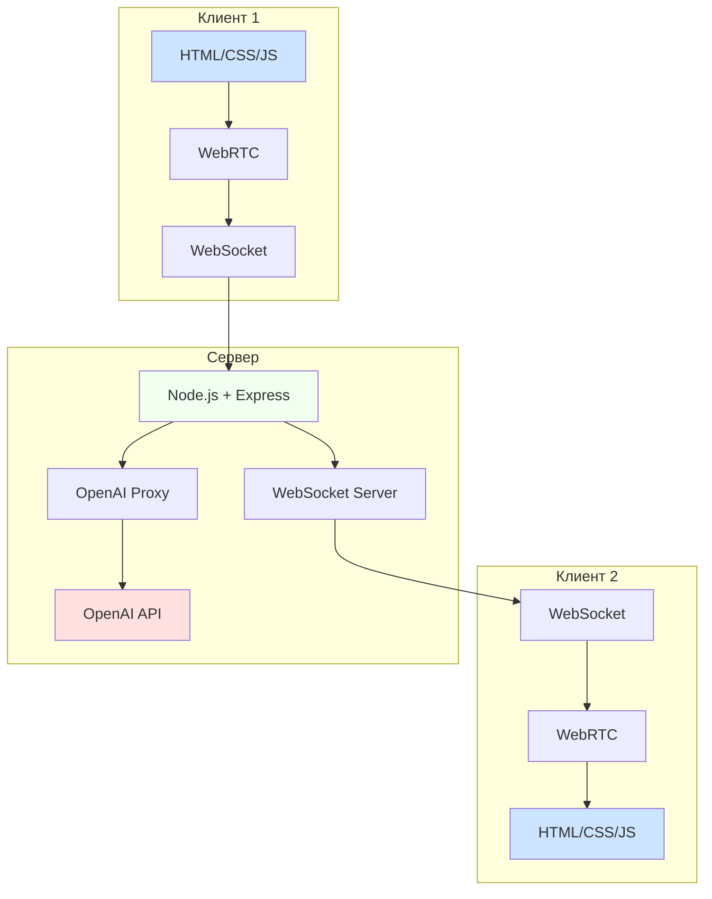

# Полная архитектура приложения для перевода голоса в реальном времени

## Обзор

Приложение представляет собой веб-платформу для перевода голоса в реальном времени между двумя пользователями через браузер. Использует WebRTC для передачи аудио, OpenAI Realtime API для перевода и имеет минимальный UI без регистрации. Архитектура спроектирована как прототип для измерения задержки (latency) при переводе голоса.

## Архитектурная диаграмма



## Структура проекта

```
voice-translation-app/
├── README.md
├── ARCHITECTURE.md
├── SERVER_SPECIFICATION.md
├── CLIENT_SPECIFICATION.md
├── PWA_PLAN.md
├── SECURITY_MEASURES.md
├── FINAL_ARCHITECTURE.md
├── package.json
├── .env
├── .gitignore
├── server.js                 # Основной сервер Node.js с WebSocket
├── config/
│   └── server.config.js      # Конфигурация сервера
├── public/
│   ├── index.html           # Главная страница приложения
│   ├── manifest.json        # Манифест PWA
│   ├── sw.js                # Service Worker
│   ├── css/
│   │   └── style.css        # Стили интерфейса
│   ├── js/
│   │   ├── main.js          # Основной клиентский скрипт
│   │   ├── webrtc.js        # Логика WebRTC соединений
│   │   └── websocket.js     # Обработка WebSocket соединений
│   └── assets/
│       ├── icons/           # Иконки интерфейса
│       └── sounds/          # Звуковые эффекты
├── routes/
│   └── api.js               # Маршруты API
└── utils/
    ├── openai-proxy.js      # Прокси для OpenAI API
    └── helpers.js           # Вспомогательные функции
```

## Описание компонентов

### Серверная часть (Node.js)

Основной файл `server.js` реализует:
- HTTP/HTTPS сервер на Express.js
- WebSocket сервер для обмена сообщениями между клиентами
- Обслуживание статических файлов из директории public
- API маршруты

Ключевые особенности:
- Управление сессиями пользователей
- Сопоставление пар пользователей для разговора
- Передача данных между участниками разговора
- Обработка событий подключения/отключения

Файл `utils/openai-proxy.js` содержит:
- Функции для взаимодействия с OpenAI Realtime API
- Обработка аудио потоков
- Перевод голоса в текст и обратно
- Обработка ошибок и ограничений API

### Клиентская часть (HTML/CSS/JS)

Файл `public/index.html` содержит:
- Минимальный UI с кнопками управления
- Элементы для воспроизведения аудио
- Индикаторы состояния

Файл `public/js/webrtc.js` реализует:
- Захват аудио с микрофона
- Создание RTCPeerConnection
- Обработка ICE кандидатов
- Управление медиа потоками

Файл `public/js/websocket.js` реализует:
- Подключение к серверу
- Обработка сообщений от сервера
- Отправка данных на сервер
- Управление состоянием соединения

Файл `public/js/main.js` содержит:
- Центральную логику приложения
- Управление состоянием UI
- Интеграцию WebRTC и WebSocket

## Поток данных

1. Пользователь открывает приложение и нажимает "Подключиться"
2. Клиент устанавливает WebSocket соединение с сервером
3. Сервер помещает клиента в очередь ожидания партнера
4. Когда второй пользователь подключается, сервер сопоставляет их
5. Клиенты обмениваются SDP описаниями через WebSocket
6. Устанавливается WebRTC соединение между клиентами
7. Клиент 1 захватывает аудио и отправляет его через WebRTC
8. Клиент 2 получает аудио, отправляет его на сервер через WebSocket
9. Сервер отправляет аудио в OpenAI API для преобразования в текст
10. Сервер переводит текст и преобразует его обратно в аудио
11. Сервер отправляет переведенное аудио клиенту 1
12. Клиент 1 воспроизводит переведенное аудио

## Безопасность

- API ключи OpenAI хранятся на сервере в переменных окружения
- Все запросы к API проходят через серверный прокси
- Валидация и ограничение запросов на стороне сервера
- Шифрование данных через WebRTC и SSL/TLS

## PWA функциональность

- Возможность установки как приложения на устройстве
- Кэширование ресурсов для быстрой загрузки
- Возможность работы в условиях медленного интернета
- Уведомления о состоянии соединения

## Технические характеристики

- Поддержка только RU ↔ EN языков
- Базовое качество аудио (mono, low bitrate)
- Минимальная реализация WebRTC без сторонних библиотек
- Только передача в реальном времени, без записи разговоров
- Нет регистрации пользователей

## Зависимости

- express: веб-фреймворк
- ws: WebSocket реализация
- dotenv: управление переменными окружения
- openai: официальный SDK OpenAI

## Переменные окружения

```
OPENAI_API_KEY=your_openai_api_key_here
PORT=3000
NODE_ENV=production
```

## Развитие проекта

Как прототип для измерения задержки, приложение может быть расширено следующими возможностями:
- Поддержка большего количества языков
- Улучшение качества аудио
- Добавление опций выбора языков
- Статистика задержек и качества связи
- Возможность групповых разговоров